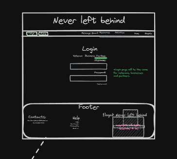

# Veteran Graphical Human Interface
## Diagram

## Homepage

This first page visitors arrive to on our website.
it will have tabs to all our services and a footer with details about 

the pictures are in a carousel.

## Login/Logout

This page is how the login and logout will look for the corresponding respective

**SignUp**
 This view for veterans and partners to signup for their respective fields
 

**Activities View**
 This is the view for the activities page and if you are an approved_partner you can create an activity
 

**Events View**
    This is the view point for the events with the map API corresponding to the selected event
    

    and if the partner is an approved_partner this their view to create an event

**MessageBoard**

This is the view for the users on the MessageBoard 

the user can see messages if not logged in but in order to reply and post their own they have to have an veteran account.

**Resources**
Anyone that visit the site can view the Resources page we did intentionally incase someone didnt want to create an account but get help from our links.

**About Us**

This page is just a description of what we offer to veterans why we do what we do!